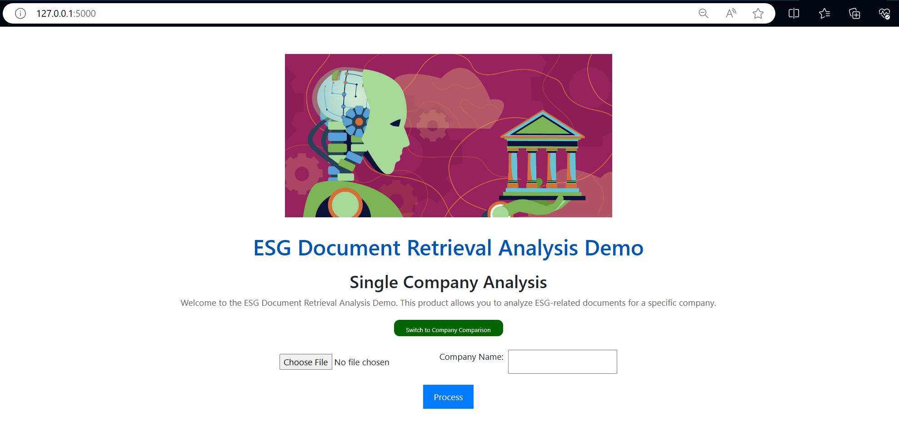

# LLM-based Information Retrieval for ESG Evaluation
This is an application for running ESG (Environmental, Social, and Governance) evaluation using the LLM (Large Language Model). The application leverages the power of natural language processing to analyze and assess the ESG performance of companies through their sustainability reports.

## Prerequisites
Before running this application, make sure you have the following:

- Anaconda / equivalent python platform is installed on your operating system.
- If you are using LLM by OpenAI as set in program, you would need the OpenAI API key (eg. `sk-o8Sdl...` ) to be saved in the config folder name as `./config/key.txt`.

## Installation
Install the virtual environment accroding to the config file `./config/env.yml`:
```
conda env create -f ./config/env.yml
```

## Usage
To start the application, you may run the pre-configured flask app:
```
flask run
```
The following ouput will display if it is successful:
```
 * Debug mode: off
WARNING: This is a development server. Do not use it in a production deployment. Use a production WSGI server instead.
 * Running on http://127.0.0.1:5000
Press CTRL+C to quit
```
Access the application in your web browser using the URL http://127.0.0.1:5000, and you shall see the picture as below:



## Contact
My name is Zino. This is an open source repository and welcome for anyone to contribute and refer. If you have any question regarding to this repository, feel free to raise it in issue. Have a nice day!

